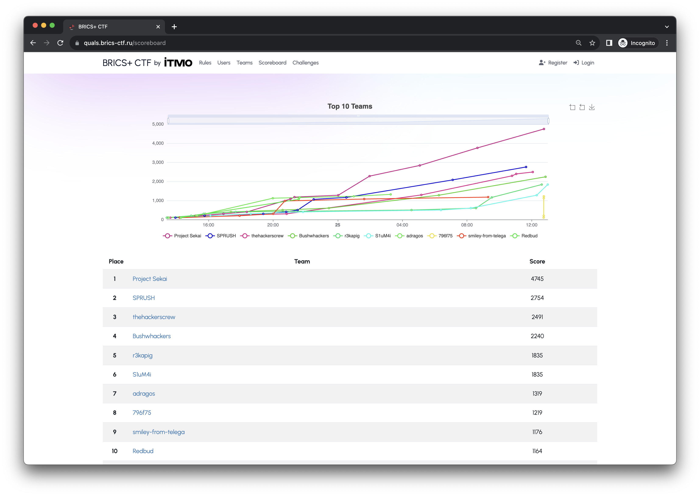

# BRICS+ CTF 2023 | Quals
Task sources & writeups from [Quals BRICS+ CTF 2023](https://brics-ctf.ru/) by C4T BuT S4D. Organized by ITMO University and ACISO.

The Quals were held on September 24, 2023.

# Results

[Full scoreboard](scoreboard/full.png)

# Team
- DevOps: [@pomo-mondreganto](https://github.com/pomo-mondreganto)
- Devteam lead: [@b1r1b1r1](https://github.com/b1r1b1r1)
- PM: [@deviantwish](https://github.com/deviantwish)

# Tasks
| Name | Category | Author|
|------|-----------|-------|
| [arc3](tasks/crp/arc3) | crypto | [@someone12469](https://github.com/someone12469) |
| [random](tasks/crp/random) | crypto | [@someone12469](https://github.com/someone12469) |
| [sqrt](tasks/crp/sqrt) | crypto | [@someone12469](https://github.com/someone12469) |
| [sss](tasks/crp/sss) | crypto | [@someone12469](https://github.com/someone12469) |
| [Dictionary](tasks/ppc/dictionary) | ppc | [@renbou](https://github.com/renbou) |
| [gif0day](tasks/ppc/gif0day) | ppc | [@jnovikov](https://github.com/jnovikov) |
| [tun](tasks/ppc/tun) | ppc | [@renbou](https://github.com/renbou) |
| [Blackmail](tasks/pwn/blackmail) | pwn | [@qumusabel](https://github.com/qumusabel)|
| [game](tasks/pwn/game) | pwn | [@user39043346](https://github.com/user39043346)|
| [paint](tasks/pwn/paint) | pwn | [@user39043346](https://github.com/user39043346)|
| [1](tasks/rev/1) | rev | [@someone12469](https://github.com/someone12469)|
| [FlagCMP](tasks/rev/flagcmp) | rev | [@renbou](https://github.com/renbou) |
| [perlovka](tasks/rev/perlovka) | rev | [@jnovikov](https://github.com/jnovikov), [@b1r1b1r1](https://github.com/b1r1b1r1) |
| [shellcode???](tasks/rev/shellcode%3F%3F%3F) | rev | [@Slonser](https://github.com/Slonser)|
| [ChadGPT](tasks/web/chadgpt) | web | [@jnovikov](https://github.com/jnovikov) |
| [GigaChadGPT](tasks/web/gigachadgpt) | web | [@jnovikov](https://github.com/jnovikov) |
| [My Secrets](tasks/web/my-secrets) | web | [@Slonser](https://github.com/Slonser)|
| [picoblog](tasks/web/picoblog) | web | [@renbou](https://github.com/renbou) |
| [elephant](tasks/for/elephant) | forensics | [@qumusabel](https://github.com/qumusabel) |
| [sralker](tasks/for/sralker) | forensics | [@someone12469](https://github.com/someone12469) |
