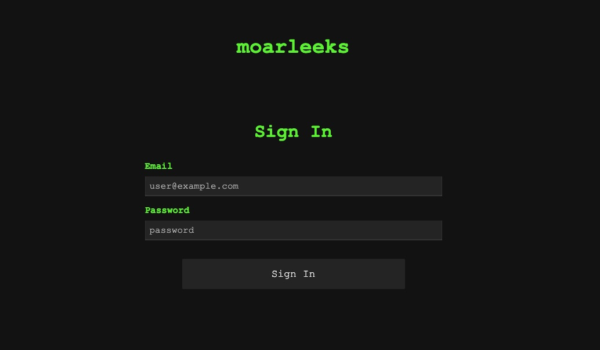
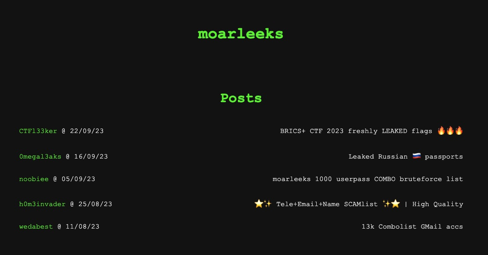

# ppc | tun

## Information

> A few of my buddies at the Sus Security department told me they'd been able to sniff up some traffic from a member of a local APT group at some cafe or something, but aren't able to connect to it in order to investigate further - they say that those APT guys use some crazy layered tunnel for comms. Mind checking it out?
>
> http://tun-3a9e4f367588e57f.brics-ctf.ru

## Deploy

```sh
cd deploy
docker-compose -p tun up --build -d
```

Don't setup reverse proxying or Cloudflare.

## Public

Provide PCAP with tunneled traffic.

## TLDR

Implement a client for the TCP-over-WebSocket and TCP-over-HTTP2 proxies mixed in a random order on each TCP connection, investigate the website using the credentials found in the PCAP, then write a simple script to try downloading the `flags.csv` file using the users found in the DB dump.

The last part is added pretty much for testing your proxy implementation :).

## Writeup

Analyzing the given PCAP doesn't reveal much straight away - it contains around 10 TCP streams, all of which seem to be a mix of binary and plaintext HTTP requests. Overall, each of the streams is formed something like this:

1. A prefix of `{"order":["http1","http2"]}` is sent by the server.
2. A Websocket upgrade is initiated by the client through an HTTP/1 request, which is accepted by the server.
3. Inside the Websocket connection a new HTTP/2 connection with prior knowledge (`PRI * HTTP/2.0\r\n\r\nSM\r\n\r\n`) is initialized.
4. The parties exchange a few HTTP/2 packets and then close the HTTP/2 connection, then the wrapping TCP connection.

Wireshark, sadly, isn't able to decode nested protocols, but, thankfully, Go provides HTTP/2 parsing via [http2.Framer](https://pkg.go.dev/golang.org/x/net/http2#Framer), and decoding compressed Websockets can be done using [compress/flate](https://pkg.go.dev/compress/flate). Here's a demo which I've used to parse the HTTP/2 frames: [solve/parse/cmd/http2/main.go](solve/parse/cmd/http2/main.go), and the compressed Websocket messages: [solve/parse/cmd/websocket/main.go](solve/parse/cmd/websocket/main.go).

At this point, if you've tried connecting to the task, you would see that the prefix is slightly different - the PCAP always contains the same order with two elements specified, while the actual task server responds with different orders consisting of 6 elements each time (though the first element is always `http1`). Here's an example: `{"order":["http1","http1","http2","http2","http1","http2"]}`.

From the gathered info, consisting of the task name and description, strange nested protocols in the PCAP, and the information sent in the prefix of the TCP stream, it should be pretty easy to realize that a multi-layer proxy client needs to be implemented. The client in the PCAP, for example, wrapped HTTP/1 requests inside an HTTP/2 stream, which itself was also wrapped in a Websocket stream. Since the order and the number of proxy layers on the task server is different from the one in the PCAP, it isn't possible to replay the packets.

Implementing the proxy clients shouldn't be too difficult, however the dynamic configuration does make it more complex and requires setting up a new chain of proxies for each connection. However, while the Websocket proxy layer can be implemented in any language without too much of a hassle, implementing the HTTP/2 layer is more complex - the streams request the `/tun.HTTP2/Proxy` path with a custom "nop" gRPC content type (`application/grpc+nop`), which actually doesn't do any marshaling/unmarshaling like protobuf would do, but rather simply contains the raw proxied bytes. Googling how to implement custom content types, however, should lead you to [this repository](https://github.com/yugui/grpc-custom-serializer), which shows how it can be done in a few languages. I've written the proxy clients in Go for both of the protocols: [solve/proxy](solve/proxy/)

Once you've managed to implement the proxy, visiting the website to which the proxies lead would show a login page:


To login you could either use the session cookie from the requests in the PCAP dump, or the email/password extracted from the requests as well. After logging in, you are greeted with a few of the available posts:


Sadly, the given user doesn't have access to the post with the supposedly leaked flags, but is able to download the "moarleeks 1000 userpass" DB dump. From here on all that needed to be done was to write a script which would try login in with the leaked users and then accessing the `flags.csv` file in the latest post: [solve/solve.py](solve/solve.py). This last part was included to pretty much test that your proxy implementation is "good enough" :).

## Domain

tun-3a9e4f367588e57f.brics-ctf.ru

## Cloudflare

No

## Flag

brics+{f1nally_a_g00d_fk1ng_pr0xy_0278705b20f3d1af}
